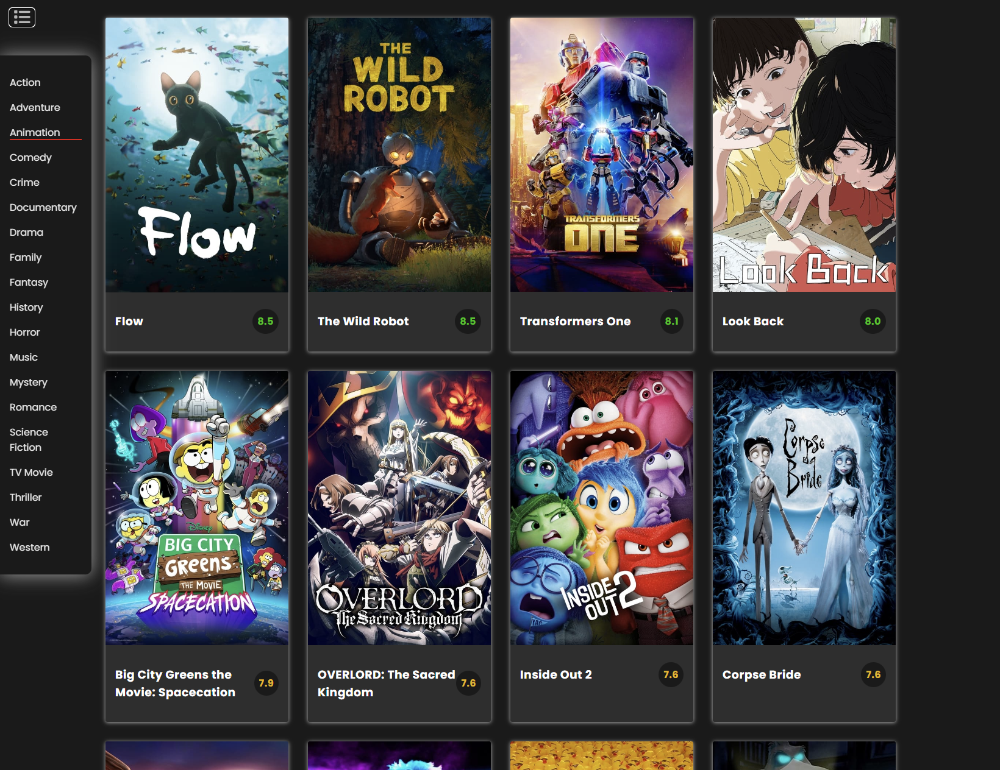

# Movie App With JavaScript

Movie App is a JavaScript-based web application. It allows users to discover movies they want to review. Users can search in the search section ,can add movies to their favorites list ,can add comments to movies,can list by categories

## Introduction

Movie App application allows users to review the movies they want.
There are popular movies on the home page.
You can find the movie you want in the search section.
When you click on any movie or click on the show overview button, you will be directed to the movie detail page, can comment
There is detailed information and trailers about the movie on the detail page.
There is a form where you can add comments.
The comments entered in the form are stored separately for each movie with a unique id.
The comments entered are stored in localStorage and are not deleted from the screen even if the page is refreshed.
User can delete the comments at any time.
User can add any movie he wants to his favorite list. User can remove it from his favorite list. Favorite lists are also stored in localStorage
When User open the category tab on the home page and click, user can list the movies in the desired category.

## Features

- 🎬 **Popular Movies**: View the list of most popular movies.
  

- 🔍 **Search Movies**: Search any movie by title.
  

- 📜 **Movie Details**: Get detailed information about a selected movie.
  

- 💹 **Movie Categories**: List movies in the selected category
  

- ✍️**Add a new comment**: Add a comment below the movie you want.
  

- ❤️**Add movies to favorites**: Add the movies you like to your favorites page.
  

  -Responsive design experience

## Technologies Used

- HTML
- CSS
- JavaScript
